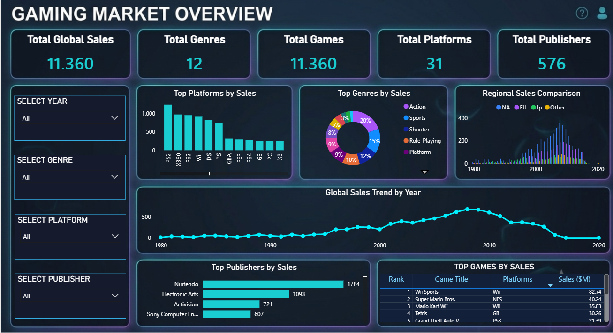

# Video Games Sales Analysis

## Project Overview

This project is an end-to-end data analysis project based on a video games sales dataset from Kaggle.

The main goal of the project is to analyze video game sales performance across different platforms, genres, publishers, regions, and years using multiple data analysis tools.

The project was completed using:

* Microsoft Excel
* SQL Server
* Python
* Power BI

---

## Objectives

The project aims to answer the following business questions:

* What are the top-selling video game platforms?
* Which genres generated the highest global sales?
* Who are the top publishers by sales?
* What are the best-selling video games?
* How did global video game sales change over time?
* How do regional sales compare across North America, Europe, Japan, and other regions?

---

## Dataset

The dataset contains video game sales data, including:

* Game title
* Platform
* Year
* Genre
* Publisher
* North America sales
* Europe sales
* Japan sales
* Other regions sales
* Global sales

Main files:

* `vgsales.csv` — original dataset
* `video_games_cleaned.csv` — cleaned dataset used for analysis

---

## Tools Used

### Excel

Used for:

* Data cleaning
* Handling missing values
* Reviewing duplicates
* Creating pivot tables
* Building an Excel dashboard
* Adding slicers, charts, KPI cards, and key insights

### SQL Server

Used for:

* Creating the database
* Importing the cleaned dataset
* Writing SQL queries for exploratory analysis
* Aggregating sales by platform, genre, publisher, game, and year

### Python

Used for:

* Reading and validating the cleaned dataset
* Handling missing publisher values
* Grouping and analyzing data using Pandas
* Creating visualizations using Matplotlib
* Exporting summary output files

### Power BI

Used for:

* Building an interactive dashboard
* Creating KPI cards
* Adding slicers
* Visualizing sales by platform, genre, publisher, region, and year

---

## Project Structure

```text
Video Games Data/
│
├── Excel/
│   └── Excel cleaning, analysis, and dashboard files
│
├── Outputs/
│   ├── top_platforms.csv
│   ├── top_genres.csv
│   ├── top_publishers.csv
│   ├── top_games.csv
│   ├── year_sales.csv
│   ├── video_games_python_cleaned.csv
│   └── powerbi_dashboard.png
│
├── Python/
│   └── video_games_python_analysis.ipynb
│
├── Sql/
│   └── video_games_sql_analysis.sql
│
├── PowerBI/
│   └── video_games_sales_dashboard.pbix
│
├── vgsales.csv
├── video_games_cleaned.csv
└── README.md
```

---

## Data Cleaning

The cleaning process included:

* Reviewing missing values
* Handling missing `Year` values
* Handling missing `Publisher` values
* Reviewing duplicate records
* Creating a final sales field for analysis
* Preparing the cleaned dataset for Excel, SQL, Python, and Power BI

---

## Excel Analysis

Excel was used to perform the first stage of analysis.

Main tasks included:

* Cleaning the raw dataset
* Creating pivot tables
* Analyzing sales by platform, genre, publisher, game, and year
* Building an interactive Excel dashboard
* Adding KPI cards, slicers, charts, and key insights

---

## SQL Analysis

A SQL Server database was created for the project.

Database name:

```sql
VideoGamesDB
```

Main table:

```sql
dbo.video_games
```

SQL analysis included:

* Previewing the data
* Counting total rows
* Calculating total global sales
* Finding top platforms by sales
* Finding top genres by sales
* Finding top publishers by sales
* Finding top games by sales
* Analyzing sales trends by year

SQL file:

```text
Sql/video_games_sql_analysis.sql
```

---

## Python Analysis

Python was used for additional analysis and validation.

Python tasks included:

* Reading the cleaned CSV file
* Checking data types and missing values
* Handling missing publisher values
* Creating grouped analysis tables
* Visualizing results using Matplotlib
* Exporting analysis outputs as CSV files

Python notebook:

```text
Python/video_games_python_analysis.ipynb
```

Output files:

```text
Outputs/top_platforms.csv
Outputs/top_genres.csv
Outputs/top_publishers.csv
Outputs/top_games.csv
Outputs/year_sales.csv
Outputs/video_games_python_cleaned.csv
```

---

## Power BI Dashboard

An interactive Power BI dashboard was created to summarize the key findings.

The dashboard includes:

* Total global sales
* Total games
* Total platforms
* Total genres
* Total publishers
* Top platforms by sales
* Top genres by sales
* Regional sales comparison
* Global sales trend by year
* Top publishers by sales
* Top games by sales
* Interactive slicers for year, platform, genre, and publisher

Dashboard file:

```text
PowerBI/video_games_sales_dashboard.pbix
```

Dashboard preview:



---

## Key Insights

Main insights from the analysis include:

* Some gaming platforms generated significantly higher global sales than others.
* A small number of genres contributed a large share of total sales.
* Regional sales patterns differ across North America, Europe, Japan, and other regions.
* Global video game sales changed noticeably over time.
* The top games and publishers represent a strong share of overall market performance.

---

## Skills Demonstrated

This project demonstrates the following skills:

* Data cleaning
* Data analysis
* Exploratory data analysis
* Excel pivot tables
* Excel dashboarding
* SQL querying
* SQL aggregation
* Python data analysis
* Pandas
* Matplotlib
* Power BI dashboard design
* Data visualization
* Business intelligence
* Portfolio project documentation

---

## Author

**Mahmoud Salem**

Aspiring Data Analyst
Excel | SQL | Python | Power BI
